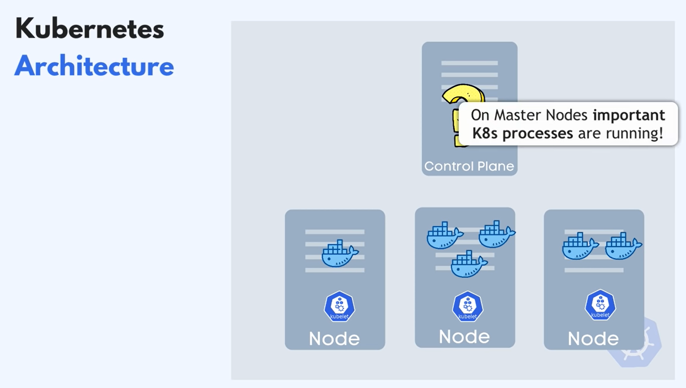

# K8s

## Project Demo :

Features :

- \*\*High Availability or no downtime
- Scalability or high performance
- Disaster recovery - backup and restore\*\*

Kubelets : are Primary “node agents”

Communaction between clusters and execute tasks on their nodes

Worker nodes are where the actual work is happening

Loosing a CP Node will also lose access to the nodes so that’s why we always have at least 2

ie LoadBalancer

External Service & Internal Service (default)

**Config Map** : External Configuration ex: Database url

**Secrets** : Used to score secured data ex: users, passwords, Certificates …

(needs to be encrypted by 3rd party not included by default)

Can be refferenced using envirement Variables

if DB container or Pod gets restared the data would be gone so we use Volumes

Volumes : Data Storage on local machine Or remote, outside of the K8s cluster

K8s does’t manage **Data Persistance**

To avoid downtime when an application pod dies replicate everything and to facilitate creating pods we use D**eployements** instead of creating pods manualy,

Also when a pod dies our service will forward the requests to another one

We Can’t replicate DB with Deployements, because databases are statefull (to avoid data inconsistencies R/W Are Synchronized)

We introduce another Componenet **StatefullSets**

Statefullsets are kinda a pain in the ass so usually Databases are hosted outside of kub cluser and only stateless apps are kept inside

**Etcd** hold the status of any kube component and kube compares it with Current state and goes to work

#### K8s manifest files

- mongo-config.yaml
- mongo-secret.yaml
- mongo.yaml
- webapp.yaml

#### K8s commands

##### start Minikube and check status

    minikube start --vm-driver=hyperkit
    minikube status

##### get minikube node's ip address

    minikube ip

##### get basic info about k8s components

    kubectl get node
    kubectl get pod
    kubectl get svc
    kubectl get all

##### get extended info about components

    kubectl get pod -o wide
    kubectl get node -o wide

##### get detailed info about a specific component

    kubectl describe svc {svc-name}
    kubectl describe pod {pod-name}

##### get application logs

    kubectl logs {pod-name}

##### stop your Minikube cluster

    minikube stop

 

> :warning: **Known issue - Minikube IP not accessible**

If you can't access the NodePort service webapp with `MinikubeIP:NodePort`, execute the following command:

    minikube service webapp-service

 

#### Links

- mongodb image on Docker Hub: https://hub.docker.com/_/mongo
- webapp image on Docker Hub: https://hub.docker.com/repository/docker/nanajanashia/k8s-demo-app
- k8s official documentation: https://kubernetes.io/docs/home/
- webapp code repo: https://gitlab.com/nanuchi/developing-with-docker/-/tree/feature/k8s-in-hour
